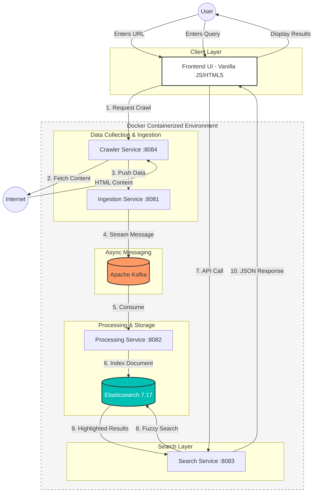

# Mini-Google  Distributed Microservices Search Engine

<p align="center">
  
</p>

A fully functional, distributed search engine architecture built with **Spring Boot**, **Apache Kafka**, and **Elasticsearch**, all containerized using **Docker**. This project demonstrates a production-grade pipeline: from web crawling to real-time indexing and fuzzy search.

## 🏗 Architecture & Services

## 🛠 Technology Stack

* **Backend:** Java 17, Spring Boot 3.
* **Messaging:** Apache Kafka & Zookeeper.
* **Search Engine:** Elasticsearch 7.17.
* **DevOps:** Docker & Docker Compose.
* **Frontend:** Vanilla JavaScript, HTML5, CSS3.

## 🚀 Getting Started

### Prerequisites
* Docker Desktop installed.
* Java 17 & Maven.


### 1. Build the Project
Package the microservices into JAR files:
```bash
mvn clean package -DskipTests
```

### 2. Launch with Docker Compose

Run the entire stack (all 8 containers) with a single command:

```bash
docker-compose up --build -d
```

* The `--build` flag ensures your latest JAR files are used to create the Docker images.
* The `-d` flag runs the containers in detached mode (background).


## 🔍 Usage

### Web Interface

1. Open `frontend/index.html` in your web browser.
2. Type a search query (e.g., "Java") and click **Search**.
3. The UI will display results fetched from the **Search Service** with real-time hit highlighting.

### Crawling a New Page

To add new content to the search engine, send a POST request to the **Crawler Service**:

* **Endpoint**: `http://localhost:8084/api/crawler/crawl`
* **Method**: `POST`
* **Body (JSON)**:

```json
{ 
  "url": "https://en.wikipedia.org/wiki/Java_(programming_language)" 
}
```

## 📈 Key Features

* **Fuzzy Search**: Handles typos and similar terms using Elasticsearch fuzzy queries, ensuring users find what they need even with imperfect input.
* **Decoupled Architecture**: Uses Apache Kafka as a message broker to ensure reliable, asynchronous data flow between services.
* **Service Discovery**: Services communicate within a private Docker network using internal service names instead of hardcoded IP addresses.
* **Real-time Highlighting**: Provides visual context in search results by highlighting the exact snippets where matches were found.
* **Scalable Design**: Each component is containerized and can be scaled independently to handle increased load.


